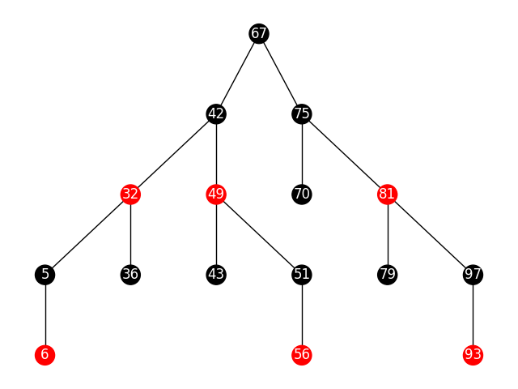
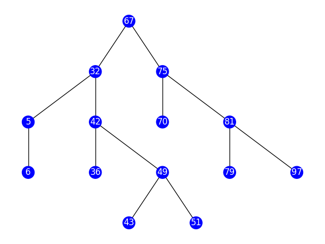

# RB and AVL tree vializator

Draws trees using logs given to it as terminal input

## How it looks

### Red-black



### AVL



## Building execution

`pyinstaller -F main.py --hidden-import='PIL._tkinter_finder'`

## Usage

The executable needs to be given the text logs by standart in (terminal prompt).
Example of the input logs:

```text
RB
67 black
42 black 67
32 red 42
5 black 32
6 red 5
36 black 32
49 red 42

```

1 line - the type of the tree(AVL or RB)

2 line - root node: value, color(or value, something for AVL)

3 - 8 line - body nodes: value, color, parent value(or value, something, parent value for AVL)

9 line - empty line to draw window

**!!!Important** Number of spaces between values must be 1 and inside there can't be any spaces. Something value for AVL can't be omitted. It ignores in code but for proper execution must be something.

The program draws tree when it read empty line and stop executing.
To continue simply close the window.
